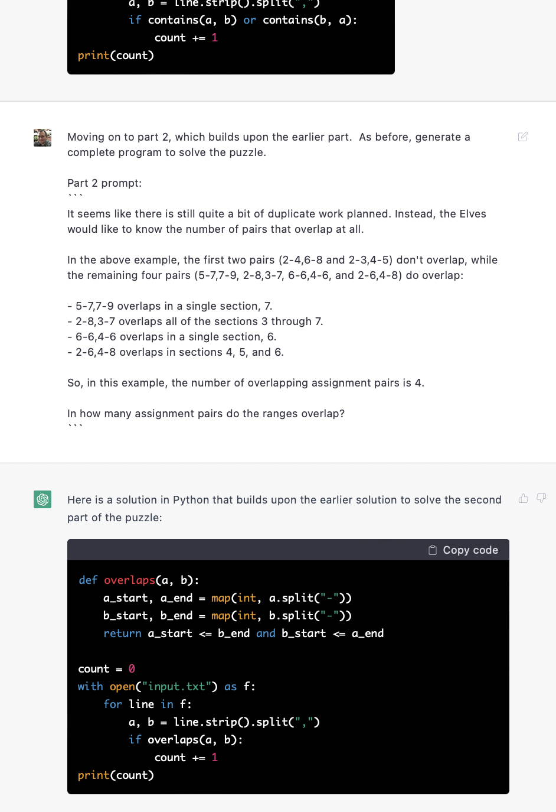

Exercises from the [2022 Advent of Code](https://adventofcode.com/2022).

This year I decided to try something different: prompt [ChatGPT](https://openai.com/blog/chatgpt/) to generate programs that solve the puzzles.

My prompts generally give a short preamble, like:

> Advent of Code is a Christmas-themed series of programming puzzles.  Each day there are two parts to a puzzle, with the second part building upon the first one.  I will provide you with the prompt for the first part.  I want you to generate a complete program in Go, Rust, or Python to solve the puzzle.  The program should read its input from a file named `input.txt`.

and then provide the puzzle text verbatim.

Sometimes this is enough to generate a working solution on the first try or after a couple of retries.  Other times, I have to provide more hints.

In each directory there is a README that gives some commentary, the prompt I provided, and the response ChatGPT generated.  Also in that directory is the (completely unmodified!) working code and the input file provided with the puzzle.

We'll see how far I get with this.

